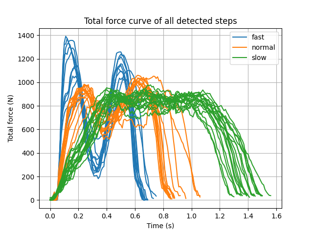
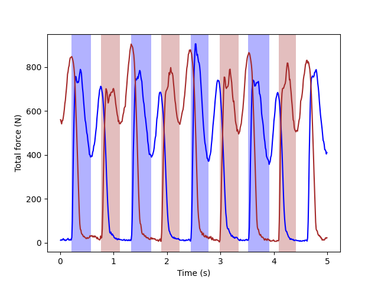

# Examples

This directory contains various examples demonstrating features of the Moticon-OpenGo
library.

To run them, make sure you have `moticon-opengo` installed, then run the example you
want with `python <example file name>.py` on the command line.


## 1. Processing Text Export Data

### 1.1 Example: Loading files and working with step events

Script: `demo_text_export_grf_curves.py`

This script processes three sample text files which have been exported from a `.go`
file. When recording the data, the tags "normal", "slow", and "fast" have been used in
the [OpenGo App](https://moticon.com/opengo/app) to label the data according to the
walking characteristics of the subject. These tags are contained in the `.txt` file
headers.

To iterate over all `.txt` files contained in a folder, and to then load each `.txt`
file as a `Measurement`, we use the following lines of code:

```Python
    for i, fname in enumerate(TxtExportFileIterator(testdata_dir)):
        meas: Measurement = Measurement(fname)
```

Prior to export, the Gait Report was run on the data, so the exported files contain step events which have been automatically detected by the
[OpenGo Software](https://moticon.com/opengo/software).

For every measurement, we can simply iterate over all steps, for which the `.txt` files
contain step events in a separate column, marking the heel strike and toe off events.
Using these step events, we can simply slice the measurement data into the data chunks
of interest (here, ground contact phases). To also include the data slightly before and
after the ground contact, we shift the index values by 5:

```Python
        for step in meas.steps:
            h: int = step.heel_strike_idx - 5
            t: int = step.toe_off_idx + 5
```

The `Measurement` object provides a convenient way of accessing the raw measurement
data. In this example, we use the time and the total force data channels. As we want to
generate a plot where the total force curves of all the steps overlap, we subtract the
heel strike time (`meas.time[h]`) from each time vector slice:

```Python
            time: np.array = meas.time[h:t] - meas.time[h]
            total_force: np.array = meas.side_data[step.side].total_force[h:t]
```

The rest of the script is then simply standard Matplotlib plotting code, generating the
following plot:




### 1.2 Example: Data slicing using manually set events

Script: `demo_text_export_events.py`

In this example, we will see how manually set events can be used for data slicing. The
sample `.txt` file (`../tests/testdata/walk_data_with_events/text_export.txt`) was
exported from a `.go` file containing the following events:

  - Even channel group names: `left_events` and `right_events`
  - Event names: `Event`
  - Event values: `1` marking the heel strike, `2` marking the local total force minimum
    in the middle of the stance phase.

Assume we want to analyze each step which was manually marked by the above events, by
computing the COP path length from event `1` to event `2`. We would expect that the
center of pressure (COP) has travelled about 50% of the sensor insole size during this
period, but want to assess this numerically based on the measured COP data.

Let's get started with loading the exported `.txt` file as `Measurement`:

```Python
meas: Measurement = Measurement(
    os.path.join(
        os.path.dirname(__file__),
        "../tests/testdata/walk_data_with_events/text_export.txt",
    )
)
```

The channel group names `left_events` and `right_events` (set in the OpenGo Software)
are available in the exported `.txt` file as columns named `Left Events` and
`Right Events`.

> Note: This capitalization is of the column name is standard. If in doubt, have a look
> at the channel headers contained in each exported `.txt` file.

We use the `Side` enum defined in `utils.py` to distinguish left and right, and start
with plotting the total force of each side using Matplotlib:

```Python
    for side, color in zip(Side, ["blue", "brown"]):
        group_name: str = f"{side.name.capitalize()} Events"
        plt.plot(meas.time, meas.side_data[side].total_force, color=color)
```

The `get_event_pairs()` function provides a convenient way of accessing events as pairs,
so we have a start event and a stop event for slicing data.

> Note: Have a look at the optional parameters of `get_events()` and
> `get_event_pairs()`, which allow for filtering events.

As the data slices of interest don't overlap in this example, we don't even have to make
use of the event values (`1` and `2`), but simply filter by `group_name`:

```Python
        for event_pair in meas.get_event_pairs(
            start_group_names=[group_name], stop_group_names=[group_name]
        ):
```

With this, we can easily slice the raw measurement data (the x/y COP data channels, in
this case), by using the data `index` which each `TxtExportEvent` provides:
```Python
            cop = meas.side_data[side].cop[event_pair[0].index : event_pair[1].index, :]
```

To compute a **COP path length** for each data slice, we define the function
`cop_trace_length()`. Apart from Euclidean distance computation for successive COP
points, this function filters out zero-valued COP.

> When the total force is low, the sensor insole will set the COP value to (0, 0),
> avoiding COP flickering due to sensor noise.
> When computing a COP path length, there zero-valued COP points should be removed, in
> order to avoid artificial COP motions to/from point (0, 0).

The script prints the following results:

```
Left COP path length: 0.5017828720317127
Left COP path length: 0.5937513600699661
Left COP path length: 0.578787104412742
Left COP path length: 0.6092960864277919
Right COP path length: 0.6249538568488697
Right COP path length: 0.5980489083999627
Right COP path length: 0.5877444902898921
Right COP path length: 0.5315810725127053
```

The script also generates a plot, to verify that we have taken the correct data slices:




## 2. Processing Gait Report Data

### 2.1 Example: Processing higher-level gait analysis outcomes

Script: `demo_gait_report.py`

The spreadsheet export of a gait report contains a wide range of gait-specific outcome
parameters, which can be easily accessed using the `GaitReport` class.

This script just showcases one of them, which is cadence.

To do this over a potentially large number of gait reports, we make use of the
`GaitReportFileIterator`:

```Python
    for fname in GaitReportFileIterator(testdata_dir):
        rep = GaitReport(fname)
```

At this point, the outcome parameters are readily available, e.g. cadence:

```Python
        print(rep.cadence)
```

For the three sample `.xlsx` files, this will print the following:

```
46.13192317118362
29.53443123572969
59.60862316938989
```

The gait report spreadsheet also contains per-step information. To see how this works,
let's use the last `GaitReport` we have loaded above, iterate over all contained
`steps`, and print the time of initial contact for each step:

```Python
    for step in rep.steps:
        print(f"Step on {step.side} side, t={step.time_initial_contact}")
```

This will print the following:

```
Step on Side.LEFT side, t=2.64
Step on Side.RIGHT side, t=3.212
Step on Side.LEFT side, t=3.713
Step on Side.RIGHT side, t=4.223
Step on Side.LEFT side, t=4.722
Step on Side.RIGHT side, t=5.224
Step on Side.LEFT side, t=5.715
Step on Side.RIGHT side, t=6.215
Step on Side.LEFT side, t=6.694
Step on Side.RIGHT side, t=7.216
```
